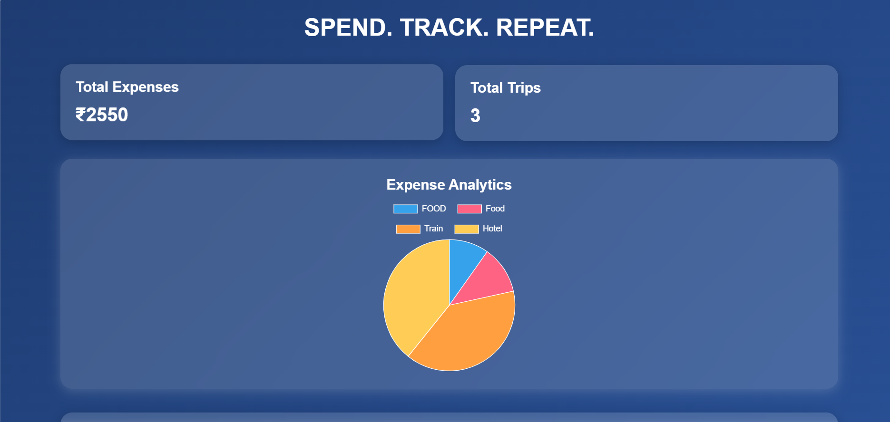
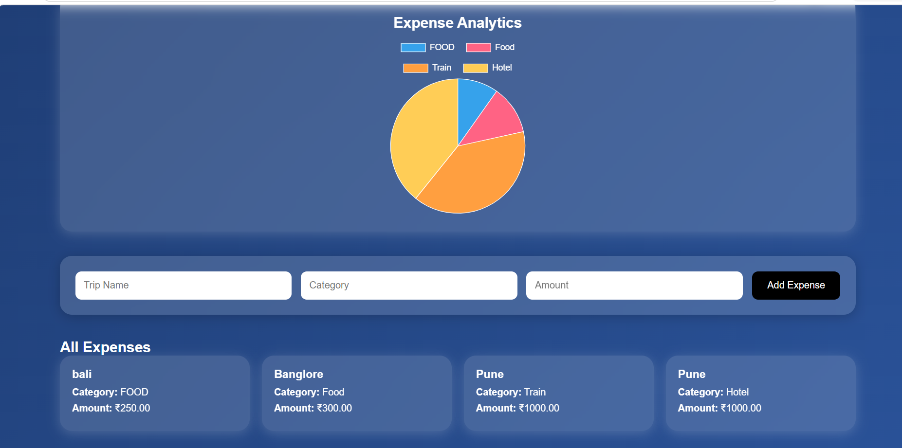

# Smart Trip Expense Dashboard

A full-stack web application that helps users track and manage their trip expenses in one place. Users can record expenses by trip and category, view all expenses, monitor total spending, and analyze spending patterns through an interactive dashboard with charts.

---

## 🚀 Features

- Add trip expenses
- View all recorded expenses
- Track total spending
- Display total number of trips
- Category-wise expense analysis
- Interactive Pie Chart using Chart.js
- Responsive and modern dashboard UI
- MySQL database integration

---

## 🛠️ Technologies Used

- HTML5
- CSS3
- JavaScript
- Node.js
- Express.js
- MySQL
- Chart.js

---

## 📂 Project Structure

```
Smart-Trip-Expense-Dashboard/
│
├── public/
│   ├── css/
│   ├── js/
│   └── images/
│
├── views/
│
├── routes/
│
├── database/
│
├── app.js
├── package.json
├── README.md
└── .gitignore
```

---

## ⚙️ Installation

1. Clone the repository

```bash
git clone https://github.com/yourusername/Smart-Trip-Expense-Dashboard.git
```

2. Navigate to the project

```bash
cd Smart-Trip-Expense-Dashboard
```

3. Install dependencies

```bash
npm install
```

4. Configure your MySQL database.

5. Start the server

```bash
npm start
```

6. Open your browser and visit

```
http://localhost:3000
```

---

## 📸 Screenshots


---

## 📌 Future Improvements

- User authentication
- Budget planning
- Export expenses to PDF/Excel
- Monthly reports
- Dark mode

---

## 👨‍💻 Author

**Anil Biradar**